

<!-- PROJECT SHIELDS -->
<!--
*** I'm using markdown "reference style" links for readability.
*** Reference links are enclosed in brackets [ ] instead of parentheses ( ).
*** See the bottom of this document for the declaration of the reference variables
*** for contributors-url, forks-url, etc. This is an optional, concise syntax you may use.
*** https://www.markdownguide.org/basic-syntax/#reference-style-links
-->
[![Contributors][contributors-shield]][contributors-url]
[![Forks][forks-shield]][forks-url]
[![Stars][stars-shield]][stars-url]
[![Issues][issues-shield]][issues-url]
[![MIT License][license-shield]][license-url]
[![LinkedIn][linkedin-shield]][linkedin-url]

<!-- PROJECT LOGO -->
 

  
  

<h3 align="center">Shotgrid Hammerspace</h3>

  

    a custom file metadata integration between Hammerspace and Shotgrid allowing simple selection of files for instantiation in other sites
     
    <a href="https://github.com/mabott/sghs"><strong>Explore the docs »</strong></a>
     
     
    <a href="https://github.com/mabott/sghs">View Demo</a>
    ·
    <a href="https://github.com/mabott/sghs/issues">Report Bug</a>
    ·
    <a href="https://github.com/mabott/sghs/issues">Request Feature</a>
  

<!-- TABLE OF CONTENTS -->

  
Table of Contents

  <ol>
    <li>
      <a href="#about-the-project">About The Project</a>
      <ul>
        <li><a href="#built-with">Built With</a></li>
      </ul>
    </li>
    <li>
      <a href="#getting-started">Getting Started</a>
      <ul>
        <li><a href="#prerequisites">Prerequisites</a></li>
        <li><a href="#installation">Installation</a></li>
      </ul>
    </li>
    <li><a href="#usage">Usage</a></li>
    <li><a href="#roadmap">Roadmap</a></li>
    <li><a href="#contributing">Contributing</a></li>
    <li><a href="#license">License</a></li>
    <li><a href="#contact">Contact</a></li>
    <li><a href="#acknowledgments">Acknowledgments</a></li>
  </ol>

<!-- ABOUT THE PROJECT -->
## About The Project

Shothammer is a shotgunEvents plugin that can respond to status change events by setting
custom metadata on files and directories. This metadata can be used to drive data placement and location
using SmartObjectives on a Hammerspace Global Data Environment.

Currently, shothammer.py watches for tags added to or removed from Shots, Sequences, or Tasks in Shotgrid. When 
it sees tags in the allowed namespace (currently tags named `SGHS_*`) it adds them as Hammerspace keywords to the root 
of the specified template folders on a Hammerspace file system. The tag schema is controlled in Shotgrid,
and the tag names are passed through directly as Hammerspace keywords.

It finds the appropriate folder(s) by using a per-project Pipeline Configuration containing path templates fed to it by 
Shotgrid. This config can be specified in Shotgrid by adding the plugin id `sghs.` to the specific pipeline 
configuration for the project.

Shothammer requests the templates specified in `shothammer_config.yml` under the appropriate object name in the 
`SGHS_PATH_TEMPLATES` dictionary.

sghs is intended to grow as a package over time with multiple plugin modules that do different things with Shotgrid's
events or webhooks.

(<a href="#top">back to top</a>)

### Built With

* [Python](https://python.org/)
* [shotgunEvents](https://github.com/shotgunsoftware/shotgunEvents)
* [Shotgrid Toolkit](https://github.com/shotgunsoftware/tk-core)
* [Hammerspace Toolkit](https://github.com/hammer-space/hstk)

(<a href="#top">back to top</a>)

<!-- GETTING STARTED -->
## Getting Started

Here are some basics on getting up and running. Everyone's Shotgrid instance is configured a bit differently and
will require some configuration depending on paths and pipeline configuration names and such.

### Prerequisites

1. [Shotgrid API](https://github.com/shotgunsoftware/python-api) installed and configured 
2. [Shotgrid event daemon](https://github.com/shotgunsoftware/shotgunEvents) installed and configured
3. [Hammerspace Toolkit](https://github.com/hammer-space/hstk) (hstk) installed: `$ pip install hstk`, though this will 
also be taken care of when installing Python requirements below.
4. Hammerspace file system mounted

### Installation

1. Clone this repository `git clone https://github.com/mabott/sghs.git`
2. Copy or link shothammer.py to your shotgunEvents plugin directory, specified in `shotgunEventDaemon.conf` as one of 
potentially several `paths` in the `[plugins]` section.
3. Install requirements `pip install -r requirements.txt`

### Configuration

1. Adjust shothammer_config.yml to fit environment (paths, fixing namespace overlap, etc.)
2. Copy or link shothammer_config.yml to shotgunEvents working directory 
3. One or more Hammerspace clusters set up with keyword-based objectives to drive data placement 
(e.g. `IF HAS_KEYWORD("SGHS_LOCATION") THEN {SLO('place-on-local-volumes)}`)

### Troubleshooting

Given the appropriate values in shothammer_config.yml, the tests in test_shothammer.py should pass. If the plugin gets
disabled by shotgunEvents then there is a fatal problem somewhere. Running the tests using nose/pytest/your favorite IDE
should give enough details to show what is broken. [Open an issue](https://github.com/mabott/sghs/issues) with details 
and someone will try to help.

#### Things to check:
1. Make sure hstk is installed in the same environment (venv, preferably) running shotgunEvents.
2. Make sure the authentication information for Shotgrid is complete, both name and application key, for the 
shotgunEvents config as well as the shothammer config.

(<a href="#top">back to top</a>)

<!-- USAGE EXAMPLES -->
## Usage

Once the plugin has been added to a ShotgunEvents server, it will recognize Tag Change events on Shots, Sequences, or 
Tasks and act accordingly. Before anything can happen, you need to perform a little more configuration of Shotgrid and 
Hammerspace.

Add SGHS-specific tags to your Shotgrid Tags via the admin menu. Click on your user portrait in the upper right and 
scroll down a bit):

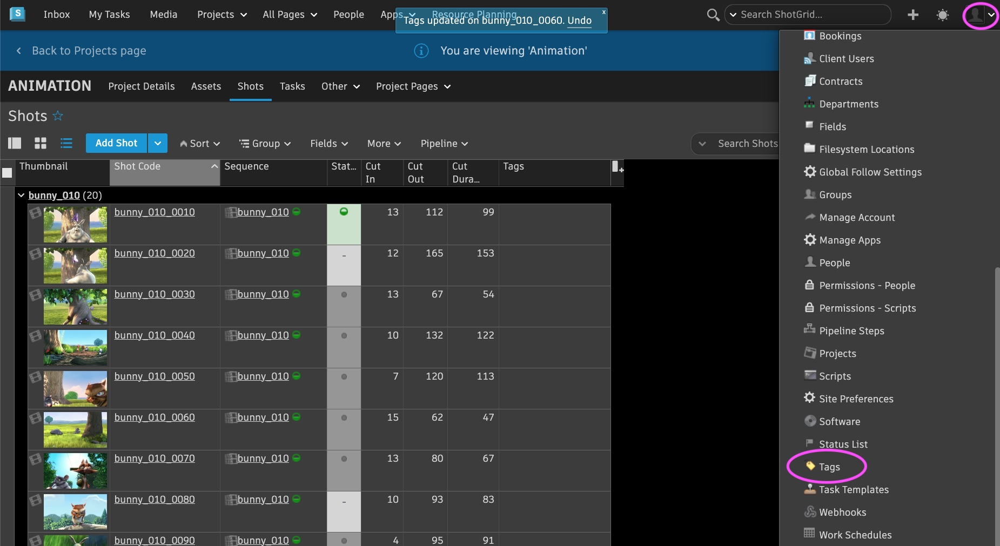

Click the Add Tag button in the upper left and add a tag in the text field of the dialog box that pops up. By default, 
we want to use tags in the SGHS_ namespace, but this can be modified in the plugin config.

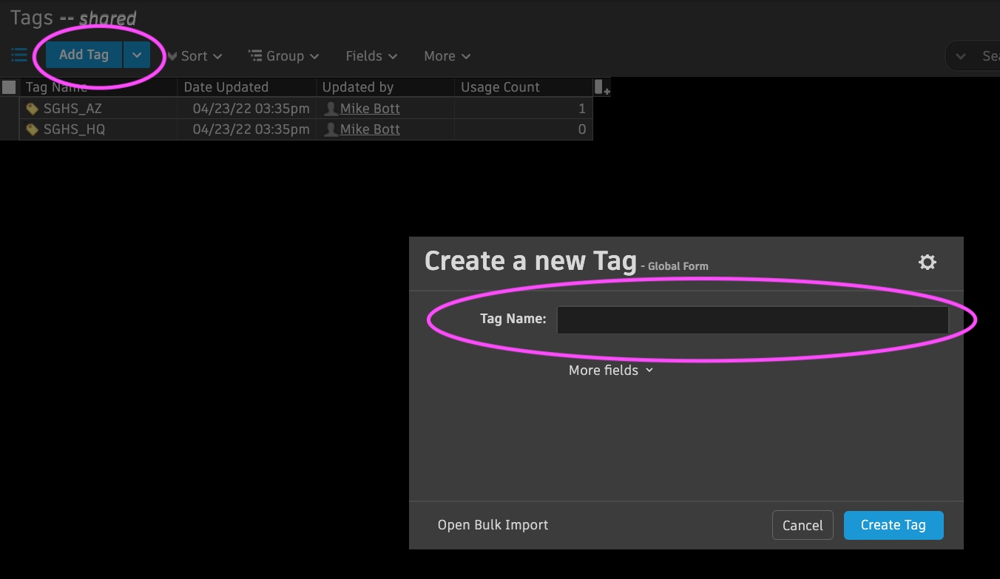

On your Hammerspace clusters, create Hammerspace Objectives on all sites that look for Keywords (a flavor of 
Hammerspace metadata) that match the Tags you added to Shotgrid. For example, on a Site called AZ you could make an 
Objective called `local-if-keyword-az`, expressing "If a file is in the live tree (i.e. not in a snapshot) and either 
it or a parent has the Hammerspace Keyword "SGHS_AZ" then instantiate this file on a volume in the Hammerspace Volume 
Group called `local-volumes`":

    IF (IS_LIVE && HAS_KEYWORD("SGHS_AZ")) 
    THEN {SLO('place-on-local-volumes')}

Apply the per-site objective to the appropriate shares:

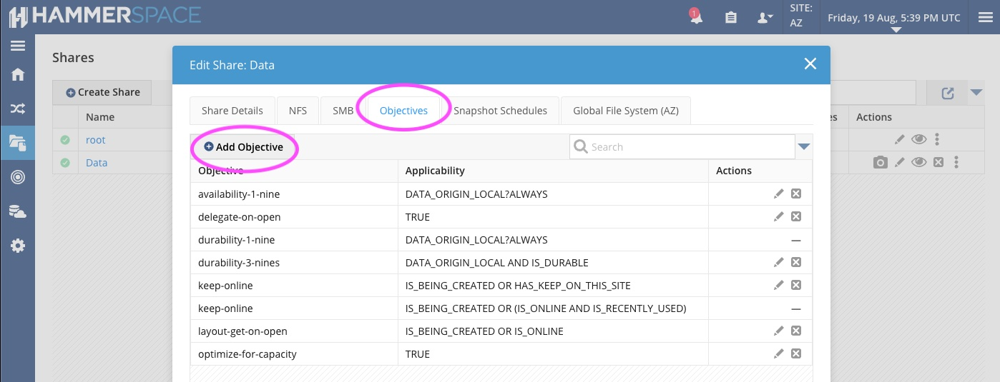
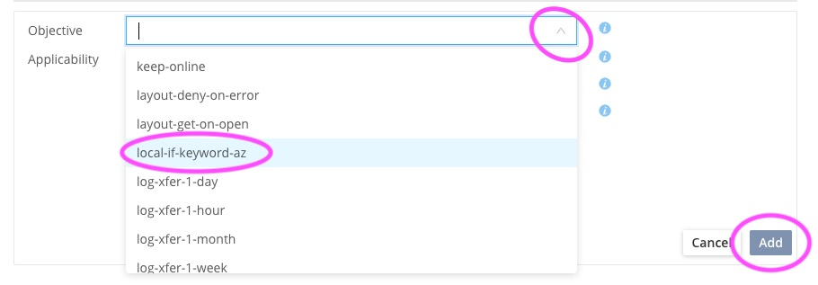
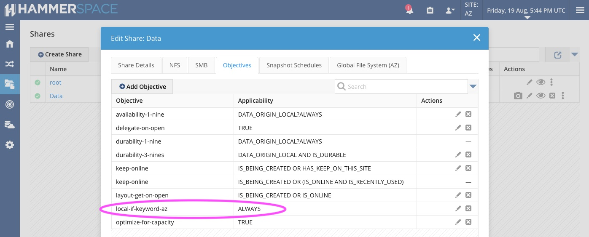

View a list of shots in Shotgrid (Project->Shots Tab) and enable viewing of the 'Tags' column:

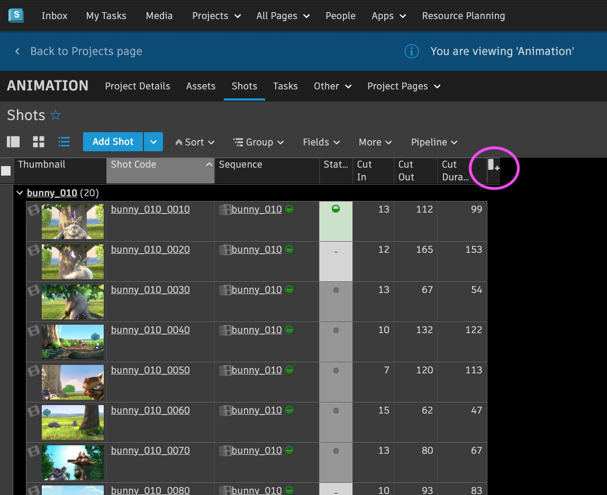
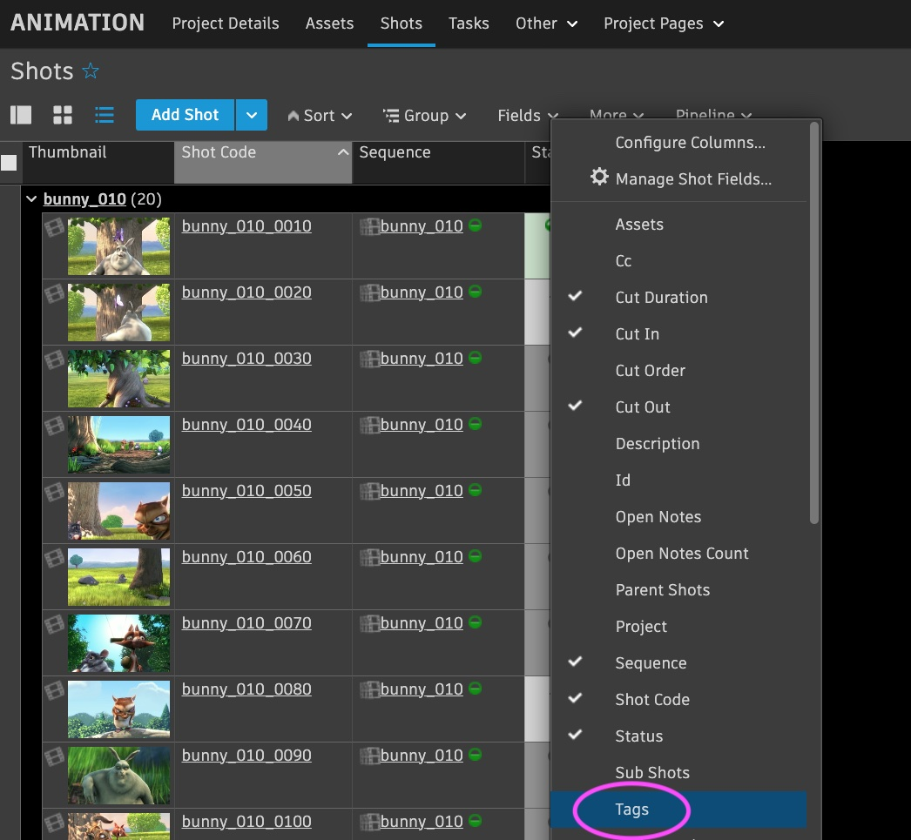
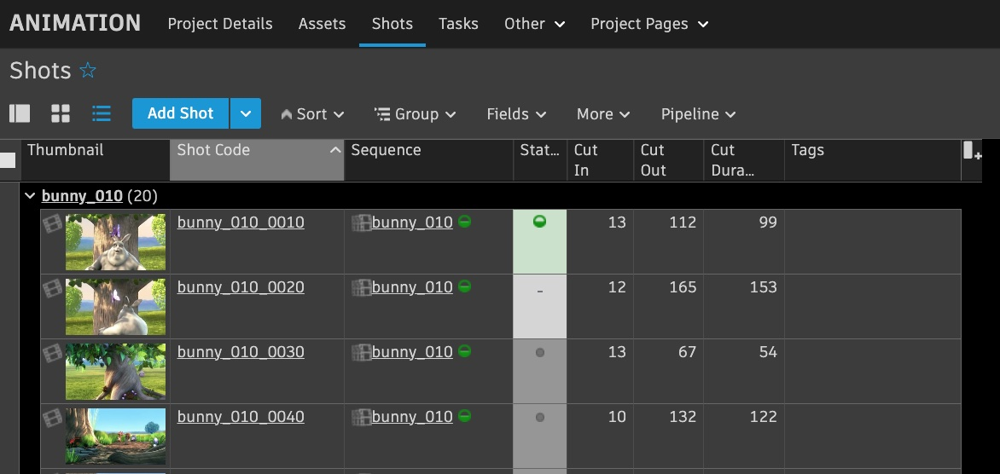

Check the Remote status and Alignment of a shot's directories. The directory paths are determined by the value of 
`SGHS_PATH_TEMPLATES['Shot']` in `shothammer_config.yml`, which might be something like "shot_root" in the 
[default shotgrid toolkit config](https://github.com/shotgunsoftware/tk-config-default2). If there are no local file 
instances in the path you are observing, you will see Remote Yes and Green alignment for files, meaning that all 
Objectives have been satisfied.

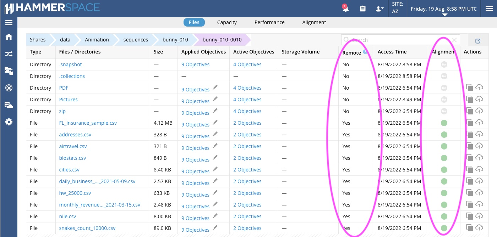

Set a tag on a Shot that matches the Keyword the Objective is looking for:

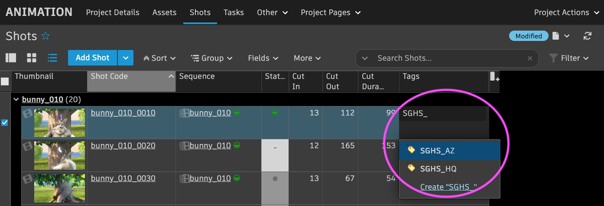

The plugin will set the keyword on the file system at the top level directory for the shot, causing the AZ system to 
recognize it needs some local data instances and request them from HQ. You can observe this by looking at the same 
path. Alignment will be Yellow while data is transferring, and once a file has been transferred it will be Remote 
Yes(cached), and Alignment will be green again, meaning that the shot now has local data instances in AZ.

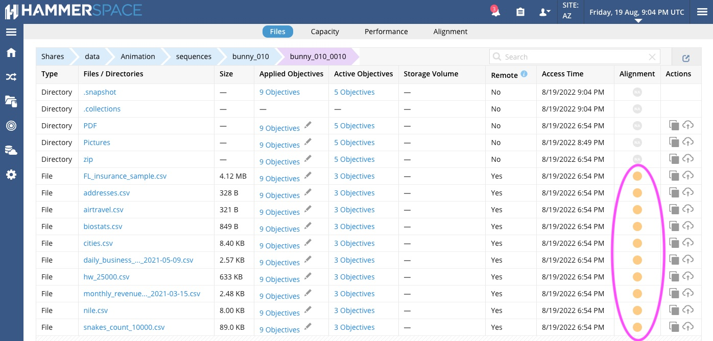
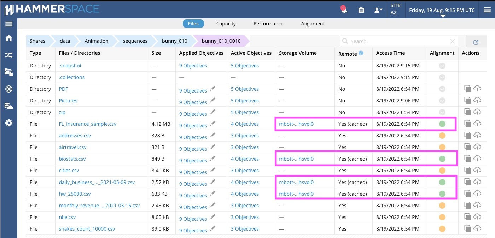

Access to these files on the AZ Hammerspace cluster will now be local access, instead of remote!

(<a href="#top">back to top</a>)

<!-- ROADMAP -->
## Roadmap

- [ ] Reduce the weight of the recommended boilerplate pipeline config
- [ ] Find a path for more Shotgrid objects (currently just shots)
    - [X] Sequences
    - [ ] Episodes
    - [ ] Specific assets
    - [X] Tasks

See the [open issues](https://github.com/mabott/sghs/issues) for a full list of proposed features (and known issues).

(<a href="#top">back to top</a>)

<!-- CONTRIBUTING -->
## Contributing

We welcome contributions to this project so that we can make this plugin applicable to many different workflows!

Feel free to fork this repo and create a pull request. You can also just open an issue with the tag "enhancement". 
Please give the project a star if you like it. Thanks!

1. Fork the Project
2. Create your Feature Branch (`git checkout -b feature/AmazingFeature`)
3. Commit your Changes (`git commit -m 'Add some AmazingFeature'`)
4. Push to the Branch (`git push origin feature/AmazingFeature`)
5. Open a Pull Request

(<a href="#top">back to top</a>)

<!-- LICENSE -->
## License

Distributed under the MIT License. See `LICENSE` for more information.

(<a href="#top">back to top</a>)

<!-- CONTACT -->
## Contact

Mike Bott, Principal Systems Engineer - [@mabott](https://twitter.com/mabott) - mike.bott@hammerspace.com

Project Link: [https://github.com/hammer-space/sghs](https://github.com/hammer-space/sghs)

(<a href="#top">back to top</a>)

<!-- ACKNOWLEDGMENTS -->
## Acknowledgments

This project wouldn't exist without these folks' contributions:

* [Jeremy Smith](mailto:jeremy.smith@jellyfishpictures.co.uk) of [Jellyfish Pictures](https://jellyfishpictures.co.uk/) 
for his technical vision, guidance, and support
* [Dan Hutchinson](dan.hutchinson@jellyfishpictures.co.uk) formerly of [Jellyfish Pictures](https://jellyfishpictures.co.uk/)
for timely application of his Python and Shotgrid knowledge
* [Natasha Kelkar](natasha.kelkar@jellyfishpictures.co.uk) of [Jellyfish Pictures](https://jellyfishpictures.co.uk/) 
for technical direction-setting, Python skills, deep Shotgrid knowledge, and steering me away from several dead ends.
* Our excellent crew at [Hammerspace](https://hammerspace.com/) for developing cool storage technology that solves 
interesting distributed storage problems

(<a href="#top">back to top</a>)

<!-- MARKDOWN LINKS & IMAGES -->
<!-- https://www.markdownguide.org/basic-syntax/#reference-style-links -->
[contributors-shield]: https://img.shields.io/github/contributors/mabott/sghs.svg?style=for-the-badge
[contributors-url]: https://github.com/mabott/sghs/graphs/contributors
[forks-shield]: https://img.shields.io/github/forks/mabott/sghs.svg?style=for-the-badge
[forks-url]: https://github.com/mabott/sghs/network/members
[stars-shield]: https://img.shields.io/github/stars/mabott/sghs.svg?style=for-the-badge
[stars-url]: https://github.com/mabott/sghs/stargazers
[issues-shield]: https://img.shields.io/github/issues/mabott/sghs.svg?style=for-the-badge
[issues-url]: https://github.com/mabott/sghs/issues
[license-shield]: https://img.shields.io/github/license/mabott/sghs.svg?style=for-the-badge
[license-url]: https://github.com/mabott/sghs/blob/master/LICENSE.txt
[linkedin-shield]: https://img.shields.io/badge/-LinkedIn-black.svg?style=for-the-badge&logo=linkedin&colorB=555
[linkedin-url]: https://linkedin.com/in/mbott
[product-screenshot]: images/screenshot.png